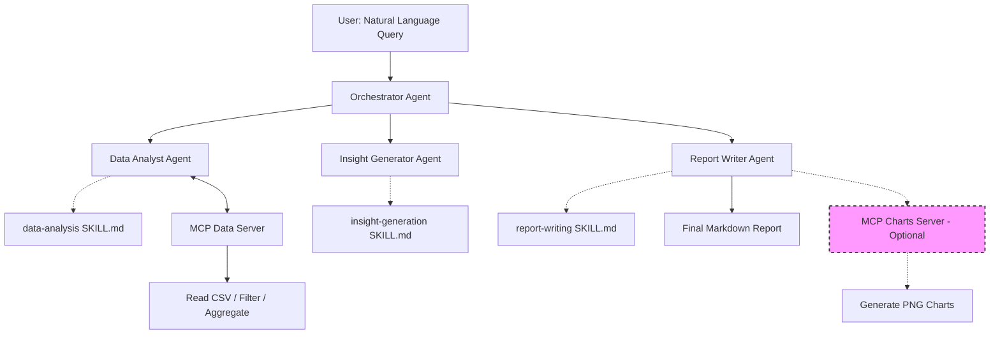

# BizInsight Agent: Multi-Agent Business Intelligence System

> A production-ready multi-agent system that automates business data analysis, generates actionable insights, and creates professional reports — demonstrating **Multi-Agent Systems**, **MCP (Model Context Protocol)**, and **Agent Skills** from the 5-Day AI Agents: Intensive Vibe Coding Course with Google & Kaggle.

---

## 🏆 Kaggle Capstone Project — Agents for Business Track

### ❌ The Problem: Hidden Costs of Manual Data Analysis
Small and medium businesses (SMBs) generate massive volumes of operational data daily (sales, expenses, inventory). However, due to resource constraints, **analyzing this data is often delayed or ignored entirely**. This leads to:
- **Missed Opportunities**: Failure to identify sales trends and customer behavior patterns.
- **Poor Decision Making**: Managing inventory and pricing without data-driven insights.
- **Operational Inefficiency**: Wasting hours manually creating repetitive reports in Excel.
- **Vulnerability**: Late detection of anomalies like sudden expense spikes or negative sales trends.

### ✅ The Solution: Autonomous Business Intelligence Agent
BizInsight Agent is an autonomous multi-agent system that allows businesses to **instantly** analyze their data, receive actionable business insights, and generate professional reports — **without needing a dedicated data analyst**.

---

## 📈 Business Impact & Value

### 💰 Financial Benefits for SMBs
1. **Reduced Analysis Costs**: Replaces the need for a part-time data analyst with a 24/7 available automated tool.
2. **Faster Decision Making**: Reduces analysis time from days to seconds — enabling real-time responses to market changes.
3. **Loss Prevention**: Early detection of anomalies (e.g., sudden drop in sales, unexpected expenses) via IQR statistical methods.
4. **Revenue Growth**: Identifies top-performing products, seasonal trends, and underpenetrated markets to optimize pricing and inventory.

### ⏱ Operational Efficiency
- **Report Automation**: Automatically generates weekly/monthly repetitive reports.
- **Reduced Human Error**: Eliminates calculation errors and manual copy-pasting.
- **Scalability**: System effortlessly handles growing data volumes as the business expands.

---

## 🧠 Key Course Concepts Demonstrated

| Course Concept | How It's Demonstrated in BizInsight |
| :--- | :--- |
| **Multi-Agent Systems** (Day 1) | 4 specialized CrewAI agents (Orchestrator, Data Analyst, Insight Generator, Report Writer) collaborate via structured delegation. |
| **MCP Servers** (Day 2) | 2 custom MCP servers (data access + optional chart generation) using Discovery → Configuration → Connection pattern. Charts server is available but not activated by default (can be enabled via configuration). |
| **Agent Skills** (Day 3) | 3 `SKILL.md` files with Progressive Disclosure (metadata → body → scripts/references). |
| **Context Engineering** (Day 1) | `AGENTS.md` provides project-level context; Skills loaded on-demand to prevent context rot. |
| **Security** (Day 4) | Input validation, sandboxed code execution, egress governance on MCP servers, Zero Ambient Authority. |
| **Spec-Driven Dev** (Day 5) | BDD specs (Gherkin), Policy Server (Zero-Trust), Context Hygiene (PII masking). |

---

## 🏗️ Architecture Overview



### Agent Roles
1. **Orchestrator Agent**: Receives user requests, breaks them into tasks, delegates to specialist agents, and synthesizes results.
2. **Data Analyst Agent**: Connects to data sources via MCP, performs statistical analysis (aggregation, trend detection, anomaly identification).
3. **Insight Generator Agent**: Transforms raw analysis into business-relevant insights using frameworks (SWOT, Pareto, growth patterns).
4. **Report Writer Agent**: Produces structured markdown reports. By default, it generates text-only reports; chart generation is an optional feature that can be enabled by providing the appropriate tools.

### MCP Servers
1. **Data Server** (`mcp_servers/data_server/`): Tools for reading CSVs, filtering, computing aggregates, and detecting anomalies. (stdio transport) – Active by default.
2. **Charts Server** (`mcp_servers/charts_server/`): Tools for generating matplotlib/seaborn charts (bar, line, pie, heatmap) and saving them as PNGs. (stdio transport) – Optional, can be activated via code changes if visual outputs are needed.

---

## 🎯 Case Study: From Data to Decisions

### 💬 User Interaction & Command
```bash
python main.py --data data/sample_business_data.csv --query "Analyze sales trends and identify top performing categories"
```

### 🤖 System Execution Flow
```text
🤖 BizInsight Agent: I'll analyze your sales data to identify trends and top-performing categories.

📊 Step 1: Data Analyst Agent loading data via MCP Data Server...
✅ Successfully loaded 54 transactions across 4 categories.

🔍 Step 2: Performing statistical analysis (IQR anomaly detection)...
📈 Found: Electronics dominates with 62.4% of total sales
⚠️ Found: Food & Beverage segment underperforming at 5.7%

💡 Step 3: Insight Generator Agent transforming raw data into business insights...
✅ Identified concentration risk in Electronics category
✅ Identified growth opportunity in West region
✅ Identified expansion potential in Food & Beverage segment

📝 Step 4: Report Writer Agent generating final report...
✅ Compiled final markdown report with executive summary and recommendations

✅ Report successfully saved to: output/business_sales_trends_analysis_report.md
```

### 📤 Generated Output Excerpt (Business Report)
The system automatically generates a comprehensive markdown report. Here is an excerpt of the actual output:

> # Business Sales Trends Analysis Report
> **Date of Generation: July 05, 2026**
>
> ## Executive Summary
> - Total sales amount to **$546,100**, with Electronics dominating at **62.4%** of total sales, indicating a high reliance on this category.
> - The region breakdown shows the South and North regions contribute **29.4%** and **26.5%** respectively, suggesting potential for growth in the less-represented West and East regions.
> - Top-performing products include Smart Watch with **$175,700** in sales, showing stable performance with no anomalies detected.
> - The Food & Beverage segment accounts for only **5.7%** of total sales ($30,900), highlighting a significant opportunity for expansion.
>
> ## Key Findings
> 1. **Electronics Dominates Revenue**: Smart watches and wireless headphones represent over **61%** of electronics sales. This presents a risk if these top products face market shifts.
> 2. **Regional Sales Distribution**: The West region remains underperforming and offers untapped demand.
> 3. **Underexploited Food & Beverage Segment**: Clearly underdeveloped relative to other categories. Strategic product expansion could significantly boost sales share.
>
> ## Recommendations
> 1. **Diversify Electronics Offerings**: Invest in complementary accessories to reduce dependency on top-tier products. *(Impact: High)*
> 2. **Expand Regional Marketing**: Focus on localized campaigns in the West and East regions. *(Impact: Medium)*
> 3. **Accelerate Food & Beverage Expansion**: Introduce organic and specialty food lines. *(Impact: High)*

---

## 🚀 Quick Start

### Prerequisites
* Python 3.10+
* An API key from [OpenRouter](https://openrouter.ai/) (supports Gemini, GPT, Claude) or Google Gemini API key.

### Installation & Execution
```bash
# 1. Clone the repository
git clone https://github.com/sAjAd-2006/bizinsight-agent.git
cd bizinsight-agent

# 2. Create virtual environment & install dependencies
python -m venv venv
source venv/bin/activate  # Windows: venv\Scripts\activate
pip install -r requirements.txt

# 3. Configure API key
cp .env.example .env
# Edit .env and add your API key

# 4. Run the analysis pipeline
python main.py --data data/sample_business_data.csv --query "Analyze sales trends and identify top performing categories"
```

---

## 📁 Project Structure

```text
bizinsight-agent/
├── AGENTS.md                    # Project-level context (Day 1: Context Engineering)
├── main.py                      # Entry point - orchestrates the full pipeline
├── specs/                       # BDD Specifications (Day 5: SDD)
│   └── analysis_pipeline.feature # Gherkin scenarios (Given/When/Then)
├── policy_server.py             # Day 5: Policy Server (Zero-Trust guardrail)
├── context_resolver.py          # Day 5: Context Hygiene (PII masking)
├── policies.yaml                # Day 5: Policy configuration
├── crew/                        # CrewAI multi-agent system
│   ├── config/                  # agents.yaml & tasks.yaml
│   ├── agents/                  # Orchestrator, Analyst, Insight, Writer
│   └── tasks/                   # analyze, generate, write tasks
├── mcp_servers/                 # MCP Servers (Day 2: Interoperability)
│   ├── data_server/             # MCP server for data access + SKILL.md
│   └── charts_server/           # MCP server for chart generation + SKILL.md (optional)
├── skills/                      # Agent Skills (Day 3: Skills)
│   ├── data-analysis/           # SKILL.md + scripts + references
│   ├── insight-generation/      # SKILL.md + frameworks
│   └── report-writing/          # SKILL.md + templates
├── data/                        # Sample dataset for demo
├── output/                      # Generated reports and charts
└── tests/                       # 48+ tests covering all 5 days' concepts
```

---

## 🧪 Testing & Evaluation

The project includes comprehensive AI-generated tests verifying skill triggering, MCP tool trajectories, and output quality.

```bash
# Run all tests
pytest tests/ -v

# Test MCP servers specifically
pytest tests/test_mcp_servers.py -v
```

---

## 🔮 Future Roadmap

- **Data Source Expansion**: Add MCP servers for Google Sheets, BigQuery, and Salesforce integration.
- **Predictive Analytics**: Implement a Forecasting Agent to predict sales trends and inventory needs.
- **User Interface**: Develop a web dashboard using Streamlit for non-technical user interaction.
- **Deployment**: Containerize with Docker and deploy on Google Cloud Run for scalable, enterprise-grade access.
- **Enhanced Visualization**: Activate and extend the Charts Server to offer more chart types and interactive visualizations.

---

## 🙏 Acknowledgments

Built as a Capstone Project for the **5-Day AI Agents: Intensive Vibe Coding Course with Google** (July 2026).
Course materials referenced:
* Day 1: The New SDLC With Vibe Coding
* Day 2: Agent Tools & Interoperability
* Day 3: Agent Skills
* Day 4: Vibe Coding Agent Security and Evaluation
* Day 5: Spec-Driven Production Grade Development

## 📝 License
MIT License — Feel free to use and modify for your own projects.